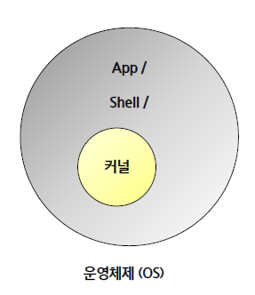
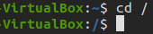

### 0316 

---
### <초기설정>

#### 우분투 설치 사이트
https://ftp.kaist.ac.kr/ubuntu-cd/20.04.5/
=> ubuntu-20.04.5-deskt-amd64.iso

#### 가상환경을 위한 VirtualBox 설치

https://www.virtualbox.org/wiki/Downloads
=> VirtualBox 7.0.6 platform packages => Windows hosts

#### VirtualBox 설치 후

1. 새로만들기 -> 이름에 ubuntu(ver)
2. 설치할 때 설정
    - 기본 메모리: 4096MB
    - Processors: 4
    -  <span style="color:yellow">Enable EFI 체크</span>
   
    - 파일 크기: 50GB 이상으로 세팅(60GB 추천)
3. 생성된 가상 컴퓨터 세부 설정
    - 설정 > 저장소 > 컨트롤러:IDE > 비어있음 > 광학 드라이브에서 디스크 모양 > 디스크 파일 선택
    - 위 경로로 간 후에 우분투 설치 이미지 삽입

---
### <이론>

#### 운영체제 종류
- Windows: PC 시장 지배
- 리눅스: 서버, 임베디드 OS 시장 지배
- Android: 리눅스로 만들어진 mobile OS
- MacOS: 유닉스로 만들어진 Apple OS
```js
중견기업 이상에서는 리눅스를 자주 사용한다.
```
<br>

#### Linux

- Linux = 오픈 소스 운영체제
- 정확히는 OS가 아닌 Kernel이다.
- Linux에 App, Shell을 추가하여 만든 하나의 운영체제인 리눅스 배포판으로 이용
```js
OS = kernel(리눅스) + shell(app)
Window OS = 윈도우용 커널이 안에 있음

Ubuntu != 리눅스
Ubuntu = 리눅스(kernel) + shell
-> Ubuntu는 리눅스 배포판이라고 생각하면 됨
```

| OS와 커널과의 관계 |
| :---:    |
||
<br>

#### 임베디드 os:

- 임베디드 운영체제는 Non-OS / RTOS(real time OS) / Linux 등이 사용된다.
=> 즉, 임베디드 개발은 꼭 Linux로 하는 것은 아니다!

<임베디드 회사에서 리눅스를 사용하는 이유>
```js
1. 구글링시 레퍼런스 다량
2. 무료 + 안정성
```

<임베디드 회사에서 리눅스를 사용을 <span style="color:red">안하는 이유</span> >
```js
1. 단가 상승 문제
2. 단순한 제품을 생산하기 때문에
    (히터, 세탁기 등)
```
<br>

#### SHELL

- Shell 은 유저가 kernel 을 다룰 수 있도록 도와주는 인터페이스!
- 사용자는 커널을 다루고 싶을 때
shell의 도움을 받아서 다루게 된다(kernel을 직접 다루는 것이 아님)
- 정확하게는 shell은 <span style="color:yellow">프로그램(=실행이 된다.)</span>이다. => 프로그림이 실행되면 프로세스라고 불림

>Shell = 운영체제 내부에 접근하기 위한 프로그램

- Shell 기반
    1. CLI Shell: 글자 기반 인터페이스
    2. GUI Shell: 그래픽 기반 인터페이스

>프로그램: 프로그래밍한 결과(0과 1로 구성된 파일)
>프로세스: 프로그램을 실행한 결과

<br>

#### 디렉토리


- Windows에서는 폴더, Linux에서는 Directory
> 우분투 GUI에서는 폴더라고 부르긴 함
- Windows 파일시스템에서 C:\ 가 root라면 Linux 파일시스템에서는 / 가 root이다.

| Linux root |
| :---:    |
||

---
### <터미널>

```js
$ cd ..
// 상위 디렉토리 이동하기

$ cd 디렉토리 이름
// 해당 디렉토리로 이동
// 현재 위치에서 갈 수 있는 디렉토리만 가능하고
// 그외는 상대경로를 제대로 작성해줘야함

$ cd ~
// 홈 디렉토리로 이동

$ cd -
// 이전 디렉토리로 되돌아가기
// 전에 사용했던 디렉토리로 돌아가는 것(경로적으로 전에 폴더가 아님)

$ cd /
// 루트 디렉토리로 이동

$ pwd
// 현재 디렉토리(폴더) 확인

$ clear
// 화면 지우기

$ exit
// 터미널 종료
```

```js
$ touch 파일명
// 새로운 빈파일 생성
// 이미 있는 파일이라면 시간을 변경
// 아래는 예시
$ touch ./newFile
// ./해주는 이유는 뒤에가 디렉토리가 아니라 파일임을 나타내주기 위함(생략 가능하긴 함)

$ rm 파일명
// 파일 삭제
// 아래 예시
$ rm ./newFile

$ mkdir 디렉토리명
// 여러개 가능(띄어쓰기로 구분)
// -p 옵션을 사용하면 하위 메뉴까지 모두 생성
// 아래 예시
$ mkdir -p ./aaa/bbb/ccc/ddd

$ rmdir 디렉토리명
// 디렉토리 삭제
// 내부에 파일이 있으면 삭제가 안됨
// 내부 파일까지 같이 삭제하기 위해선 아래와 같이 하면 된다
$ rm -r ./aaa
/// ./aaa/bbb/ccc/ddd 까지 다 지워짐

$ mv 파일 옮길곳
// 파일을 이동

$ mv 파일 파일이름
// 파일 이름 변경
// 만약 변경하려는 이름의 파일이 존재하면 그 파일은 사라지는 꼴

$ cp 파일 경로
$ cp -r 파일 경로
// 파일 복사 
```

